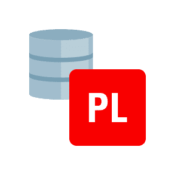

<h1 align="center">Salve! 🤙 Eu sou o Bigois!</h1>

    

        O desenvolvedor ADVPL/TL++ mais rápido do Velho Oeste Protheus 🤠
    

    
    
Bacharel em Sistemas de Informação e pós-graduando em Arquitetura e Desenvolvimento Java pela FIAP 🎓

    

    
Especialista na criação de magias e bruxarias proibidas em Hogwarts para localizar e trucidar bugs do além infinito 🧙

    
Mestre na arte da advinhação de requisitos ocultos na mente do cliente 🔮

    
E bombeiro da certificado pela FireRangers Academy de Ontario para apagar incêndios de software que surgem do nada e desaparecem da mesma forma 👨‍🚒

    

    
    
    
    
    
    

<h2 align="center">Tecnologias que eu mexo (ou já mexi) 👨‍💻</h2>

    

        
Código raíz (front-end e back-end)

        
        
        
        
        
        
        
        
        
        
        
        
    

    

        
Mobaiou (mobile)

        
        
        
        
    

    

        
Onde a magia acontece (IDEs)

        
        
        
        
        
        
        
    

    

        
Coisas que o estagiário desliga sem querer (infraestrutura)

        
        
        
        
        
        
        
        
        
        
        
    

    

        
Quando não é usado, tira a nossa paz (organização e agilidade)

        
        
        
        
        
        
        
        
        
        
        
    

    

        
Aquilo que eu não soube classificar (demais tecnologias)

        
        
        
        
    

